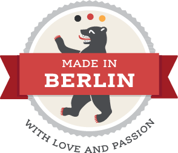

# Acknowledgments

Sysiphos stands on the shoulders of giants. It is built using:

* [Scala](http://scala-lang.org)
* [Scala.js](http://scala-js.org)
* [sbt](http://scala-sbt.org)
* [Finch](https://github.com/finagle/finch)
* [Sangria](https://github.com/sangria-graphql)
* [Akka](https://akka.io)
* [circe](https://circe.io)
* [Slick](http://slick.lightbend.com)
* [Binding.scala](https://github.com/ThoughtWorksInc/Binding.scala)
* [diode](https://github.com/suzaku-io/diode)
* [Freemarker](https://freemarker.apache.org)
* [cron4s](https://alonsodomin.github.io/cron4s)

*Made in Berlin* Logo by [Nadine Rossa](http://nadine-rossa.de)

