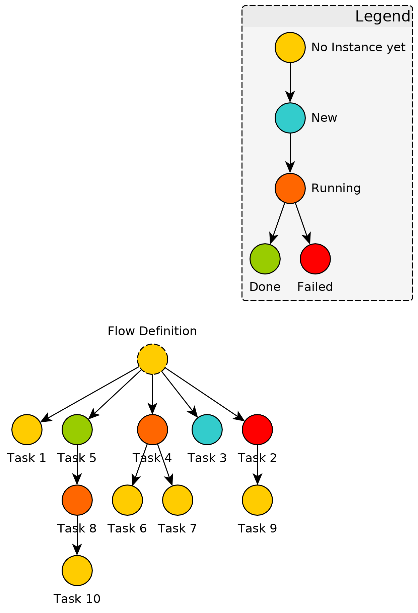

# Concurrency

Sysiphos allows to specify concurrency on both the flow instance and the task instance level 
(see @ref:[Execution Model](execution-model.md) for reference).

## Instance Level

The number of running instances can be controlled the following properties on the flow definition:

- `parallelism: Int` sets how many instances are allowed to run in parallel, if there are more instances scheduled 
they will stay in initial state until the older instances are done
- `latestOnly : Boolean` allows the scheduler to skip instances that are scheduled, 
but would lead to the same execution. Same meaning that they execute the same flow definition with the same
context values. This could occur when the instance execution is slow, so that the schedule (but also calls to the API) leads 
to more of the same instances. Skipping such instances can save time and resources.

## Task Level

Every instance actor is the holder of a task stream with a source queue that can be controlled via the following properties 
on the flow definition:
 
- `taskParallelism: Int` defines how many tasks can run in parallel in a given instance 
- `taskRatePerSecond: Int` defines how many tasks will at max be done per second

The task parallelism also defines how many task actors will be available for the work
generated by the task stream. There is a back-pressure mechanism in place, so new instances
will only be executed if the of pool task actors has the capacity. Otherwise the enqueueing into 
the queue of the task stream will be denied.

The example in the diagram shows a graph with two tasks running in parallel.
 
In this state only `Task 1` would be considered runnable since its the only child of a done parent 
(the root is considered done) but assuming a `taskParallelism` of `2`, the instance actor can not enqueue this task. 

Once `Task 4` is done, the instance actor will try to enqueue both the tasks `Task 1`, `Task 6` and `Task 7` from which
only one will be enqueued.

