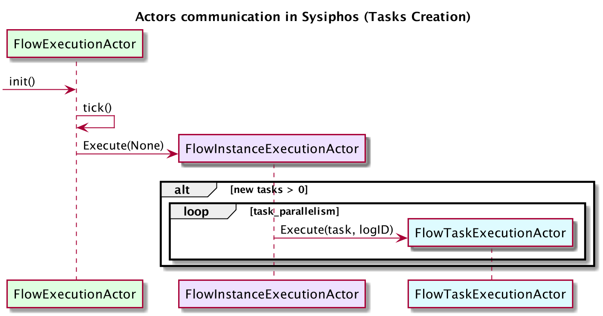
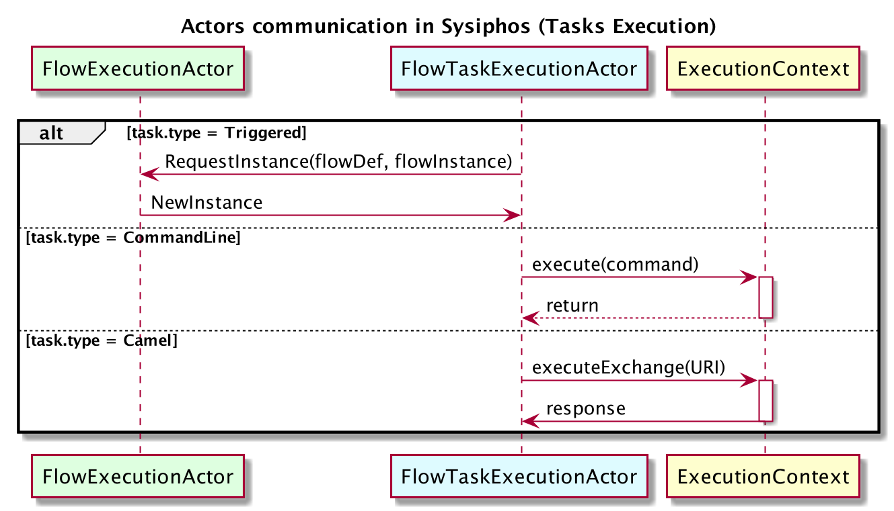
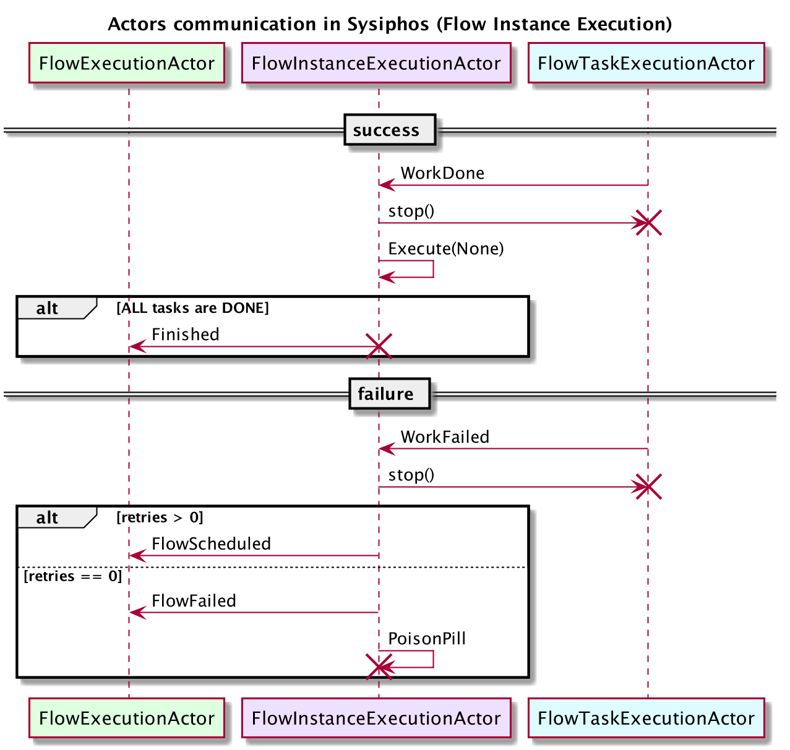
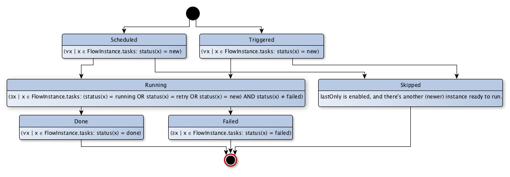

# Execution Model

The execution model of Sysiphos is implemented by an actor system using Akka.

Every entity from the @ref:[Introduction](intro.md) has a corresponding actor which
updates the underlying repository for that entity:

There is a singleton actor to control the time based aspects of the scheduling which also acts as supervisor for 
the **Flow Instance** actors. 

These instance actors will spawn **Flow Task Instance** actors matching the parent-child 
relation of the tasks in the definition. 

If a instance should be executed and the number of instances to consider for execution 
depend on the parallelism options in the flow definition:

The task instance actors are responsible for executing the task and logging the results, 
which differs depending on the task type (see @ref:[Tasks](tasks.md)):

Depending on the result of the execution, the state of the task instance and the corresponding
flow instance will be updated. Flow instances with tasks that still have retires are still 
considered as running executions:

 
The following state transitions are possible for an flow instance:
 

